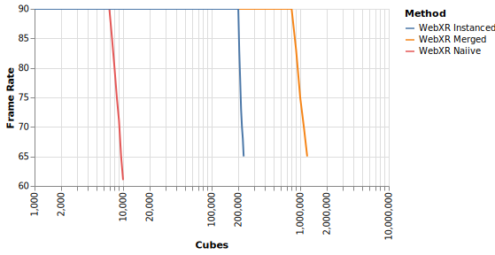

# WebXR Performance Benchmarking

Renders `n` unlit 24-vertex cubes with [`react-three-fiber`](https://docs.pmnd.rs/react-three-fiber) using a choice of 3 rendering methods:

- Naiive
- Merged meshes
- Instanced meshes

## Benchmarking Results



## Install

```bash
# Yarn
yarn install

# NPM
npm install
```

## Run Tests

Run on `localhost`:

```bash
# Yarn
yarn dev

# NPM
npm run dev
```

Run over https on the network. Replace `IP_ADDRESS` with the IP address of the host:

```bash
# Yarn
SERVE_HOST=IP_ADDRESS yarn dev

# NPM
SERVE_HOST=IP_ADDRESS npm run dev
```
